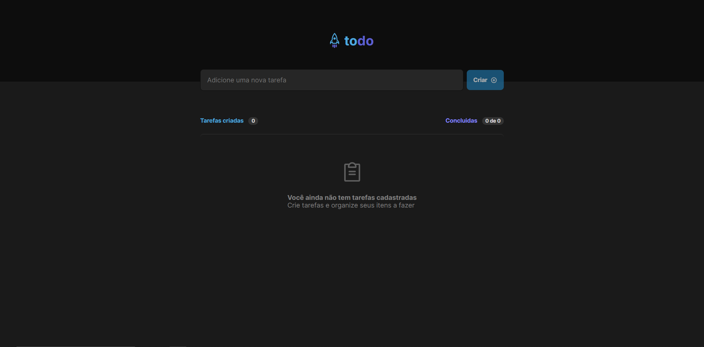
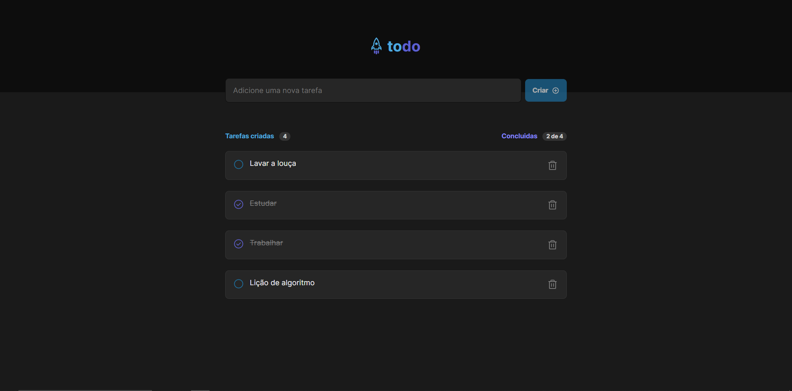

<h1 align="center">ToDo List</h1>

Desafio proposto no curso Ignite da Rocketseat, no qual foi desenvolvido uma aplicação para controle de tarefas utilizando React

 

  

  

## Tecnologias

Esse projeto foi desenvolvido com as seguintes tecnologias:

- React
- Styled Components
- TypeScript
- Vite
- Git e Github
